Summary statistics
================
JT McCrone
3/22/2017

    ## Loading required package: knitr

    ## Loading required package: ggplot2

    ## Loading required package: magrittr

    ## Loading required package: tidyverse

    ## Loading tidyverse: tibble
    ## Loading tidyverse: tidyr
    ## Loading tidyverse: readr
    ## Loading tidyverse: purrr
    ## Loading tidyverse: dplyr

    ## Conflicts with tidy packages ----------------------------------------------

    ## filter(): dplyr, stats
    ## lag():    dplyr, stats

    ## Loading required package: plyr

    ## -------------------------------------------------------------------------

    ## You have loaded plyr after dplyr - this is likely to cause problems.
    ## If you need functions from both plyr and dplyr, please load plyr first, then dplyr:
    ## library(plyr); library(dplyr)

    ## -------------------------------------------------------------------------

    ## 
    ## Attaching package: 'plyr'

    ## The following objects are masked from 'package:dplyr':
    ## 
    ##     arrange, count, desc, failwith, id, mutate, rename, summarise,
    ##     summarize

    ## The following object is masked from 'package:purrr':
    ## 
    ##     compact

    ## Loading required package: reshape2

    ## 
    ## Attaching package: 'reshape2'

    ## The following object is masked from 'package:tidyr':
    ## 
    ##     smiths

    ## Loading required package: extrafont

    ## Registering fonts with R

    ## Loading required package: wesanderson

    ## Loading required package: ggdendro

    ## Loading required package: grid

    ## Loading required package: doMC

    ## Loading required package: foreach

    ## 
    ## Attaching package: 'foreach'

    ## The following objects are masked from 'package:purrr':
    ## 
    ##     accumulate, when

    ## Loading required package: iterators

    ## Loading required package: parallel

First we'll read in the all\_meta file. Which now contains every sample we ever touched. We will filter it so that it contains 1 entry per person. This handels the cases in 2014-2015 where we have mulitple samples/ person. Although the multiple samples are important when we pick which sample to use in looking at transmission, here we just are looking at dates on onset so one sample/ person will do.

When there are 2 samples we pick the one we sequenced unless we sequenced both then we take the one that qualified for snv identification with the titer as a tie braker. If we didn't sequence either sample we pick the one to include randomly.

I should note we are taking one sample per person per infecting strain. There are cases where one person was sick twice in a season with H1N1 and H3N2. Those each counted in the meta\_one. The pcr\_result is used to identify transmission pairs later.

### Cohort stats

How many H3N2 and H1N1 did we sequence

### Table 1 stats

|pcr\_result|2010-2011|2011-2012|2012-2013|2013-2014|2014-2015|
|:----------|--------:|--------:|--------:|--------:|--------:|
|A/H1N1|26|1|3|47|NA|
|A/H3N2|58|22|66|1|166|

### Transmission rules.

These apply to all cases where 2 individuals are sick within the same household within a week of eachtoher (difference in date of onset \<= 7 days).

In the event of multiple possible donors we assume the donor is the individual with symptom onset neast to the recipeient.

The donor and recipeint are never have symptoms on the same day unless they are the only cases in the house. In this case we will randomize the pair and estimate a bottleneck both ways.

If there are two possible donors with the same date of onset then we throw out any possible pair to that recipient.

Also we require that pairs have an L1-norm below the 5% percentile of the non household pairs.

Tranmission pairs are cases where 2 people are sick with the same strain from the same household with 7 days of eachother (inclusive)

This yields 185 possible pairs. And 124 valid pairs

Summary table
-------------

However, we did not sequence every sample and every sample we sequenced did not yeild usable SNV data. We handeled 493 samples. We sequenced 367 samples or 74% of the samples. 255 samples (52%) had titers \> 1000 genomes/ul and were sequenced.

We had samples from 390 inidividuals. We sequenced samples from 298 or 76% of the individuals.

So the best we could hope for would be 87

When we further restrict our analysis and require both samples to be greater than 103 then we have 53 possible pairs. The 71 I quoted earlier included sequenced early samples and all 2014-2015 samples we handeled. I have remade the meta data csv for this analysis.

L1-norm
-------

    ## Progress disabled when using parallel plyr

    ## [1] 52

|L1\_norm|threshold|valid\_pairs|
|-------:|--------:|-----------:|
|0.00000|0.00|0|
|15.97314|0.05|47|
|22.13715|0.10|47|
|32.09874|0.15|47|
|45.40643|0.20|48|
|66.70239|0.25|48|
|70.45920|0.30|48|
|73.12239|0.35|48|
|75.70331|0.40|48|
|77.82479|0.45|50|
|79.12057|0.50|51|
|80.75706|0.55|51|
|82.54727|0.60|51|
|84.48222|0.65|52|
|86.79044|0.70|52|
|89.03344|0.75|52|
|92.02820|0.80|52|
|96.45213|0.85|52|
|162.02653|0.90|52|
|293.91248|0.95|52|
|544.34182|1.00|52|

    ## [1] 1590

    ## [1] 47

    ## [1] 15.97314

Overall Summary
---------------

|Class|All.Samples|Sequenced.samples|Titers1e3|SNV.sequenced|
|:----|----------:|----------------:|--------:|:------------|
|Households|240|191|135|133|
|Isolates|493|367|255|249|
|Individuals|390|298|205|200|
|Transmission pairs|124|87|53|52 (47)|
|Households with potential pairs|85|64|39|38|
|Longitudinal sampling|103|69|50|49|

|Individuals|2010-2011|2011-2012|2012-2013|2013-2014|2014-2015|
|----------:|--------:|--------:|--------:|--------:|--------:|
|2|13|2|9|7|23|
|3|5|2|3|3|11|
|4|NA|NA|1|2|4|
|\#\# Looking at|transmission|||||

Valid pairs
===========

Transmission rules. These apply to all cases where 2 individuals are sick within the same household within a week of eachtoher (difference in date of onset \<= 7 days).

In the event of multiple possible donors we assume the donor is the individual with symptom onset neast to the recipeient

The donor and recipeint are never have symptoms on the same day unless they are the only cases in the house. In this case we will randomize the pair and estimate a bottleneck both ways.

We'll take a look at the pairs we are refering to and then get a list of all those that quailify.

Here is a final summary table. These are the valid pairs

    ## Loading required package: tables

    ## Loading required package: Hmisc

    ## Loading required package: lattice

    ## Loading required package: survival

    ## Loading required package: Formula

    ## 
    ## Attaching package: 'Hmisc'

    ## The following object is masked from 'package:ggdendro':
    ## 
    ##     label

    ## The following objects are masked from 'package:plyr':
    ## 
    ##     is.discrete, summarize

    ## The following objects are masked from 'package:dplyr':
    ## 
    ##     combine, src, summarize

    ## The following objects are masked from 'package:base':
    ## 
    ##     format.pval, round.POSIXt, trunc.POSIXt, units

    ##                                                                         
    ##            Group                                                        
    ##            All                 Sequenced              Titer$>$1e3       
    ##            A/H1N1 A/H3N2 total A/H1N1    A/H3N2 total A/H1N1      A/H3N2
    ##  2010-2011  5      19     24    2        11     13    2            3    
    ##  2011-2012  0       6      6    0         5      5    0            1    
    ##  2012-2013  0      18     18    0        11     11    0            2    
    ##  2013-2014 18       0     18   13         0     13    6            0    
    ##  2014-2015  0      58     58    0        45     45    0           39    
    ##  total     23     101    124   15        72     87    8           45    
    ##                                  
    ##                                  
    ##        SNV qualified             
    ##  total A/H1N1        A/H3N2 total
    ##   5    2              2      4   
    ##   1    0              1      1   
    ##   2    0              2      2   
    ##   6    6              0      6   
    ##  39    0             39     39   
    ##  53    8             44     52

    ## -------------------------------------------------------------------------

    ## You have loaded plyr after dplyr - this is likely to cause problems.
    ## If you need functions from both plyr and dplyr, please load plyr first, then dplyr:
    ## library(plyr); library(dplyr)

    ## -------------------------------------------------------------------------

    ## 
    ## Attaching package: 'plyr'

    ## The following objects are masked from 'package:Hmisc':
    ## 
    ##     is.discrete, summarize

    ## The following objects are masked from 'package:dplyr':
    ## 
    ##     arrange, count, desc, failwith, id, mutate, rename, summarise,
    ##     summarize

    ## The following object is masked from 'package:purrr':
    ## 
    ##     compact

SNV summary
===========

### Titers

There are two samples here with NA DPI, I believe we don't have meta data on when the symptoms began. Also there are two samples with negative DPI. These are all removed in the DPI plots unless otherwise obvious.

    ## notch went outside hinges. Try setting notch=FALSE.
    ## notch went outside hinges. Try setting notch=FALSE.

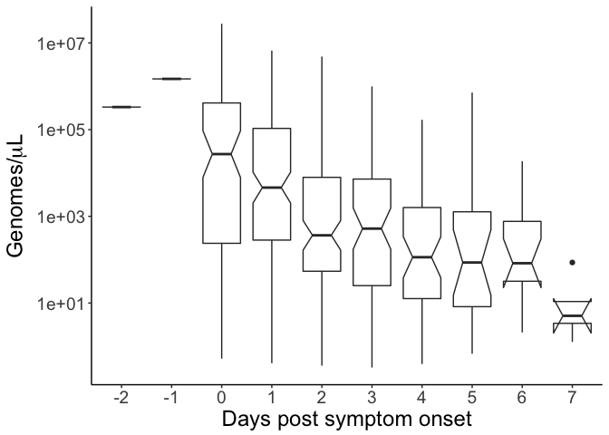 There are warning messages for 13 samples we did not get usable numbers back from the qPCR. They have NA in the log\_copy\_num column but R gives them 0 in the gc\_ul. These are removed on the log scale.

### Frequency distribution

|class\_factor|mutations|
|:------------|--------:|
|Nonsynonymous|279|
|Synonymous|434|

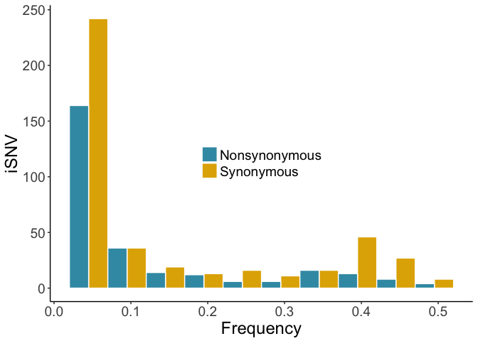

    ##    bin        V1
    ## 1    1 0.6776860
    ## 2    2 1.0000000
    ## 3    3 0.7368421
    ## 4    4 0.9230769
    ## 5    5 0.3750000
    ## 6    6 0.5454545
    ## 7    7 1.0000000
    ## 8    8 0.2826087
    ## 9    9 0.2962963
    ## 10  10 0.5000000

0.6086957

### Distribution across the genome

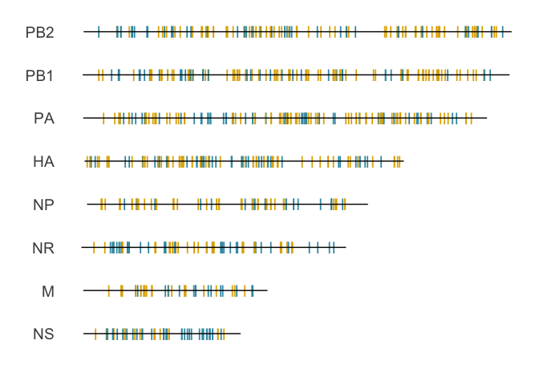

#### Sliding window geomone

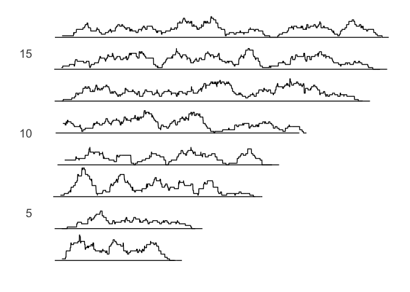 \#\#\# Distribution across Individuals - using every sample

These will need to be rare in mulitple individuals to show up here at \>1

    ## `stat_bin()` using `bins = 30`. Pick better value with `binwidth`.

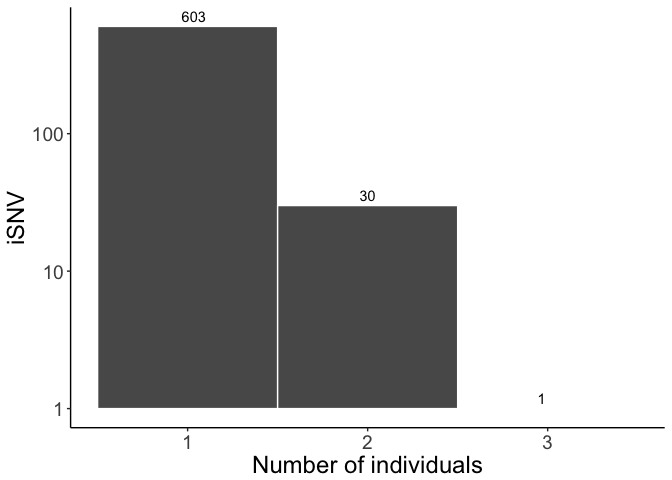 These are the mutations found in multiple individuals  These counts don't sum to the total above, but that is because this is looking at individuals above is looking at all sequenced samples (multiple/person) sometimes. If I sum these counts over SPECID then the sums are equal.

### Diversity in samples

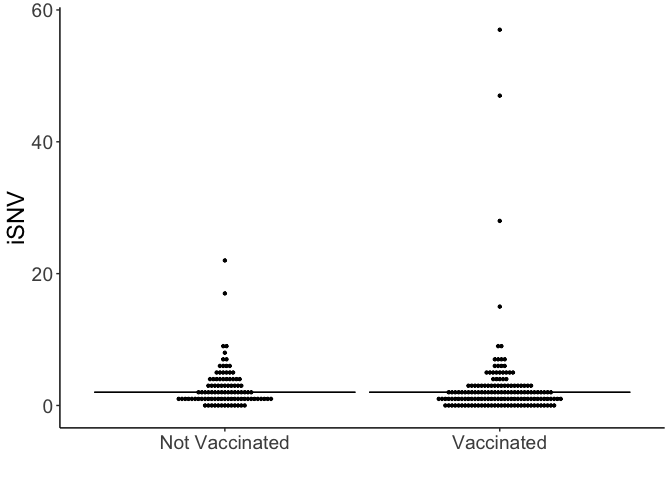

### Distribution of snv in samples (Could be multiple samples/person)

    ##   0%  25%  50%  75% 100% 
    ##    0    1    2    3   57

    ## [1] 2.863454

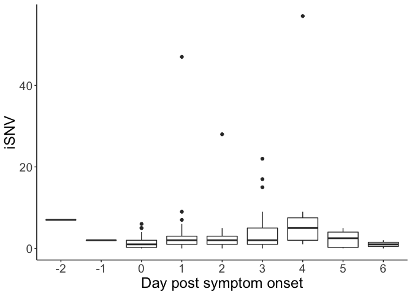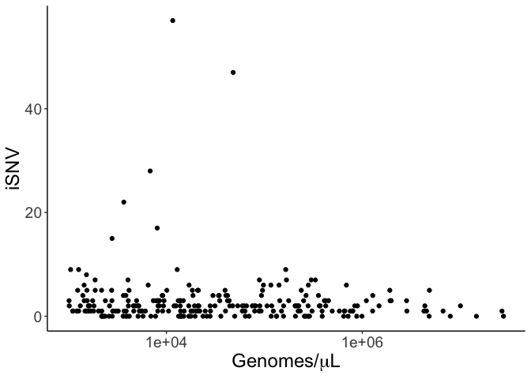

Figure 1
========

    ## Loading required package: cowplot

    ## 
    ## Attaching package: 'cowplot'

    ## The following object is masked from 'package:ggplot2':
    ## 
    ##     ggsave

    ## notch went outside hinges. Try setting notch=FALSE.
    ## notch went outside hinges. Try setting notch=FALSE.

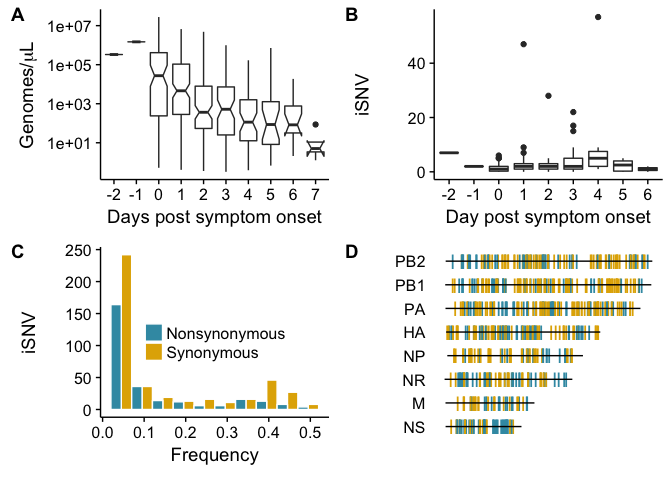

Separate Panels

    ## notch went outside hinges. Try setting notch=FALSE.
    ## notch went outside hinges. Try setting notch=FALSE.

Figure 3
========

Supplemental Figure 3
=====================

Looking at the outliers
=======================

Let's take a look at the samples with many snv.

    ## Loading required package: ggjoy

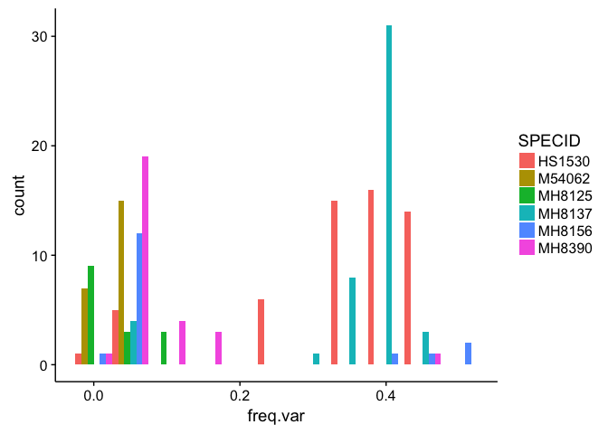 This looks like mixed infections. We find many mutations at similar frequencies.

### Intrahost set up

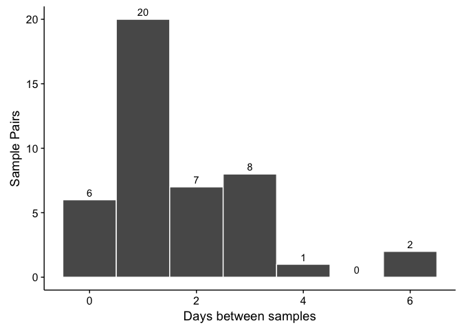

We are only looking at polymorphic sites between 2% and 98%.
