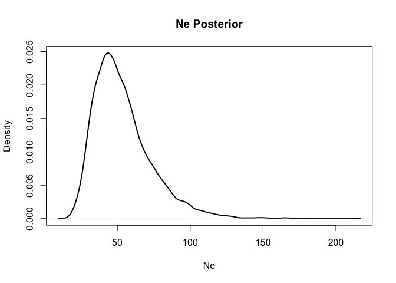
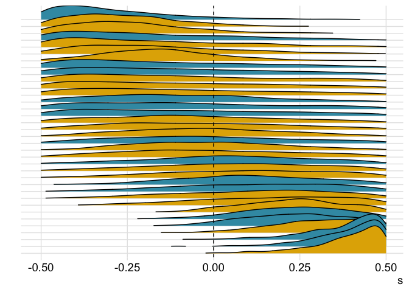
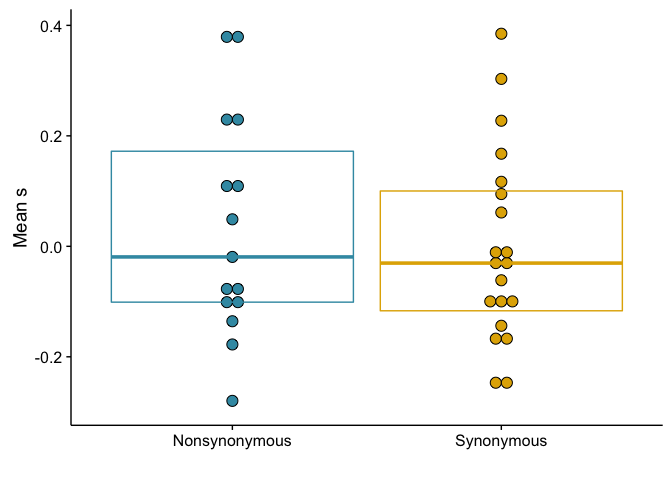
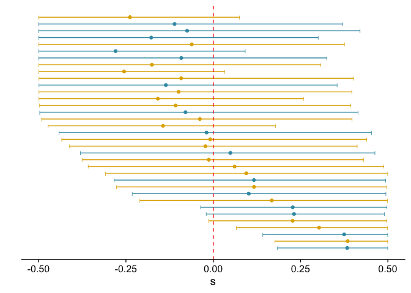
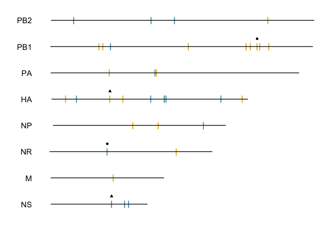

ABC
================

    ## Loading required package: knitr

    ## Loading required package: ggplot2

    ## Loading required package: tidyverse

    ## Loading tidyverse: tibble
    ## Loading tidyverse: tidyr
    ## Loading tidyverse: readr
    ## Loading tidyverse: purrr
    ## Loading tidyverse: dplyr

    ## Conflicts with tidy packages ----------------------------------------------

    ## filter(): dplyr, stats
    ## lag():    dplyr, stats

    ## Loading required package: extrafont

    ## Registering fonts with R

    ## Loading required package: wesanderson

    ## Loading required package: magrittr

    ## 
    ## Attaching package: 'magrittr'

    ## The following object is masked from 'package:purrr':
    ## 
    ##     set_names

    ## The following object is masked from 'package:tidyr':
    ## 
    ##     extract

    ## Loading required package: ggjoy

    ## Loading required package: cowplot

    ## 
    ## Attaching package: 'cowplot'

    ## The following object is masked from 'package:ggplot2':
    ## 
    ##     ggsave

    ## Loading required package: plyr

    ## -------------------------------------------------------------------------

    ## You have loaded plyr after dplyr - this is likely to cause problems.
    ## If you need functions from both plyr and dplyr, please load plyr first, then dplyr:
    ## library(plyr); library(dplyr)

    ## -------------------------------------------------------------------------

    ## 
    ## Attaching package: 'plyr'

    ## The following objects are masked from 'package:dplyr':
    ## 
    ##     arrange, count, desc, failwith, id, mutate, rename, summarise,
    ##     summarize

    ## The following object is masked from 'package:purrr':
    ## 
    ##     compact

    ## Loading required package: reshape2

    ## 
    ## Attaching package: 'reshape2'

    ## The following object is masked from 'package:tidyr':
    ## 
    ##     smiths

    ## Loading required package: ggdendro

    ## Loading required package: grid

    ## Loading required package: doMC

    ## Loading required package: foreach

    ## 
    ## Attaching package: 'foreach'

    ## The following objects are masked from 'package:purrr':
    ## 
    ##     accumulate, when

    ## Loading required package: iterators

    ## Loading required package: parallel

Now we'll set up the input file.

Time to run the first command and estimate N\_e

    ## Using 8 threads
    ## 47.7031  16.7392
    ## Using 8 threads
    ## Locus 1
    ## Locus 2
    ## Locus 3
    ## Locus 4
    ## Locus 5
    ## Locus 6
    ## Locus 7
    ## Locus 8
    ## Locus 9
    ## Locus 10
    ## Locus 11
    ## Locus 12
    ## Locus 13
    ## Locus 14
    ## Locus 15
    ## Locus 16
    ## Locus 17
    ## Locus 18
    ## Locus 19
    ## Locus 20
    ## Locus 21
    ## Locus 22
    ## Locus 23
    ## Locus 24
    ## Locus 25
    ## Locus 26
    ## Locus 27
    ## Locus 28
    ## Locus 29
    ## Locus 30
    ## Locus 31
    ## Locus 32
    ## Locus 33
    ## Locus 34
    ## Locus 35

N\_e posterior estimate
=======================

    ## Loading required package: boa

    ## Joining by: mut_id

|ENROLLID|mutation|donor\_class|mean\_s|OR|Ref\_AA|AA\_pos|Var\_AA|
|-------:|:-------|:-----------|------:|:--|:------|:------|:------|
|50874|PB1\_G1798G|Synonymous|0.3031070|['PB1']|['G']|[594]|['G']|
|50874|NR\_A501G|Nonsynonymous|0.3748509|['NR']|['N']|[161]|['S']|
|51438|NS\_T538C|Nonsynonymous|0.3835221|['NS1', 'NS2']|['I', 'L']|[171, 14]|['T', 'L']|
|51438|HA\_T524C|Synonymous|0.3848628|['HA']|['S']|[165]|['S']|
