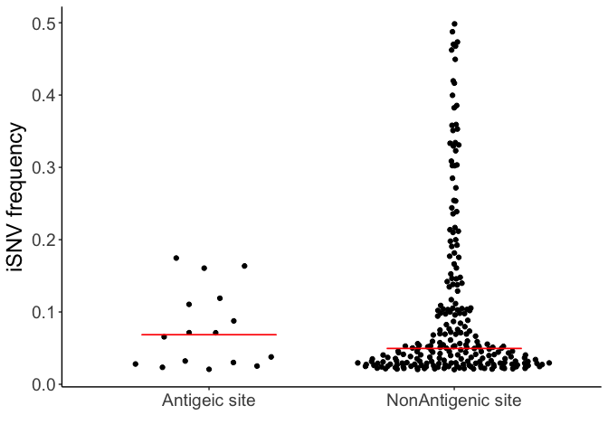

Antigenic analysis
================

    ## Loading required package: knitr

    ## Warning: package 'knitr' was built under R version 3.4.1

    ## Loading required package: ggplot2

    ## Loading required package: magrittr

    ## Loading required package: tidyverse

    ## Warning: package 'tidyverse' was built under R version 3.4.2

    ## ── Attaching packages ─────────────────────────────────────────────────────────────────────── tidyverse 1.2.0 ──

    ## ✔ tibble  1.3.4     ✔ purrr   0.2.4
    ## ✔ tidyr   0.7.2     ✔ dplyr   0.7.4
    ## ✔ readr   1.1.1     ✔ stringr 1.2.0
    ## ✔ tibble  1.3.4     ✔ forcats 0.2.0

    ## Warning: package 'tibble' was built under R version 3.4.1

    ## Warning: package 'purrr' was built under R version 3.4.2

    ## Warning: package 'dplyr' was built under R version 3.4.2

    ## ── Conflicts ────────────────────────────────────────────────────────────────────────── tidyverse_conflicts() ──
    ## ✖ tidyr::extract()   masks magrittr::extract()
    ## ✖ dplyr::filter()    masks stats::filter()
    ## ✖ dplyr::lag()       masks stats::lag()
    ## ✖ purrr::set_names() masks magrittr::set_names()

    ## Loading required package: HIVEr

    ## Loading required package: extrafont

    ## Registering fonts with R

    ## Loading required package: wesanderson

    ## Loading required package: doMC

    ## Loading required package: foreach

    ## 
    ## Attaching package: 'foreach'

    ## The following objects are masked from 'package:purrr':
    ## 
    ##     accumulate, when

    ## Loading required package: iterators

    ## Loading required package: parallel

Antigenic sites
===============

    ## Warning: Missing column names filled in: 'X1' [1]

    ## Warning: Duplicated column names deduplicated: 'X1' => 'X1_1' [51]

    ## Warning: Missing column names filled in: 'X1' [1]

    ## Parsed with column specification:
    ## cols(
    ##   X1 = col_integer(),
    ##   HOUSE_ID = col_integer(),
    ##   ENROLLID = col_character(),
    ##   SPECID = col_character(),
    ##   onset = col_date(format = ""),
    ##   mutation = col_character(),
    ##   freq.var = col_double(),
    ##   Ref_AA = col_character(),
    ##   H3_pos = col_integer(),
    ##   Var_AA = col_character(),
    ##   PDB_4HMG = col_character(),
    ##   PDB_4JTV = col_character(),
    ##   pcr_result = col_character(),
    ##   Antigenic = col_character(),
    ##   Source = col_character(),
    ##   vaccination_status = col_integer(),
    ##   DPI = col_integer()
    ## )

|   X1|  HOUSE\_ID| ENROLLID | SPECID | onset      | mutation  |   freq.var| Ref\_AA |  H3\_pos| Var\_AA | PDB\_4HMG   | PDB\_4JTV   | pcr\_result | Antigenic | Source |  vaccination\_status|  DPI|
|----:|----------:|:---------|:-------|:-----------|:----------|----------:|:--------|--------:|:--------|:------------|:------------|:------------|:----------|:-------|--------------------:|----:|
|   36|       5034| 50143    | HS1604 | 2015-01-11 | HA\_G997G |  0.1189658| \['I'\] |      307| \['R'\] | K307 in HA1 | K311 of HA1 | A/H3N2      | C         | Lee    |                    1|    1|
|   62|       5034| 50143    | MH9045 | 2015-01-11 | HA\_G997G |  0.1605890| \['I'\] |      307| \['R'\] | K307 in HA1 | K311 of HA1 | A/H3N2      | C         | Lee    |                    1|    2|

    ## Loading required package: ggbeeswarm

    ## Warning: package 'ggbeeswarm' was built under R version 3.4.1

    ## 
    ##  Wilcoxon rank sum test
    ## 
    ## data:  HA_NS$freq.var.x[which(HA_NS$Antigenic != "None")] and HA_NS$freq.var.x[which(HA_NS$Antigenic == "None")]
    ## W = 139, p-value = 0.4646
    ## alternative hypothesis: true location shift is greater than 0

    ## 
    ##  Two-sample Kolmogorov-Smirnov test
    ## 
    ## data:  HA_NS$freq.var.x[which(HA_NS$Antigenic != "None")] and HA_NS$freq.var.x[which(HA_NS$Antigenic == "None")]
    ## D^+ = 0.13971, p-value = 0.7249
    ## alternative hypothesis: the CDF of x lies above that of y

There are 29 mutations found above. They are from 33 individuals so many of the sites are independent.

For the whole genome

    ## 
    ##  Two-sample Kolmogorov-Smirnov test
    ## 
    ## data:  All_NS$freq.var.x[which(All_NS$Antigenic != "None")] and All_NS$freq.var.x[which(All_NS$Antigenic == "None")]
    ## D^+ = 0.18455, p-value = 0.3607
    ## alternative hypothesis: the CDF of x lies above that of y

Global dynamics
===============

This is for all variants.

This is for just antigenic mutations.

    ## [1] "HA1:86I, HA1:62G, HA1:297A, HA1:214T, HA1:242L, HA1:53E, HA1:312G, HA1:242T, HA1:189N, HA1:307R, HA1:163T, HA1:193S, HA1:128A, HA1:262N, HA1:307R"

Uncomment the lines to run for all NS HA mutations

    ## Loading required package: lubridate

    ## Warning: package 'lubridate' was built under R version 3.4.2

    ## 
    ## Attaching package: 'lubridate'

    ## The following object is masked from 'package:base':
    ## 
    ##     date

    ## Loading required package: directlabels

|   collect| SPECID | H3\_name |   freq.var| Antigenic | season    |
|---------:|:-------|:---------|----------:|:----------|:----------|
|  2011.241| M54913 | HA1:62G  |  0.0712147| E         | 2010-2011 |
|  2012.943| MH2436 | HA1:214T |  0.0656508| D         | 2012-2013 |
|  2014.882| HS1294 | HA1:242L |  0.1636028| D         | 2014-2015 |
|  2014.923| HS1376 | HA1:53E  |  0.0251913| C         | 2014-2015 |
|  2014.923| HS1376 | HA1:312G |  0.0234583| C         | 2014-2015 |
|  2014.934| HS1425 | HA1:242T |  0.0280370| D         | 2014-2015 |
|  2014.945| HS1450 | HA1:189N |  0.0378271| B         | 2014-2015 |
|  2015.030| HS1604 | HA1:307R |  0.1189658| C         | 2014-2015 |
|  2014.926| MH7755 | HA1:163T |  0.0321867| B         | 2014-2015 |
|  2014.934| MH7851 | HA1:193S |  0.1745625| B         | 2014-2015 |
|  2014.937| MH7860 | HA1:128A |  0.1105225| B         | 2014-2015 |
|  2014.948| MH8052 | HA1:262N |  0.0301232| E         | 2014-2015 |
|  2015.033| MH9045 | HA1:307R |  0.1605890| C         | 2014-2015 |

    ## Warning in apply.method(x$method, cm.data, debug = x$debug, axes2native = x
    ## $axes2native): using first element of character vector

Of the 15 antigenic variants found in our data set. 4 were found above 5% at the global populaiotn at or after the time of collection.

Non antigenic sites
-------------------

collect SPECID H3\_name freq.var Antigenic season -------- ------- -------- --------- ---------- -------

We found 17 non epitope mutations. 0 were found above 5% at the global level.
