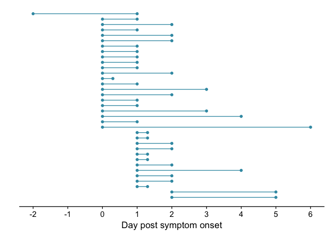
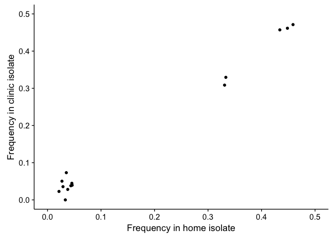
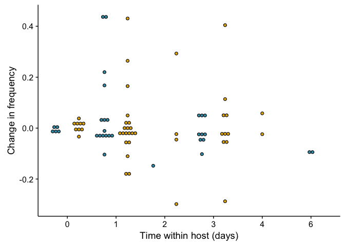
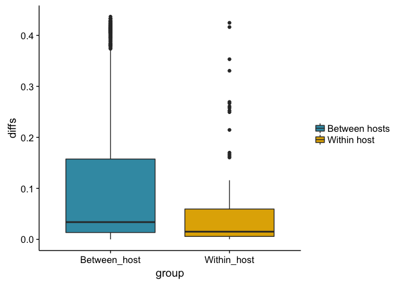
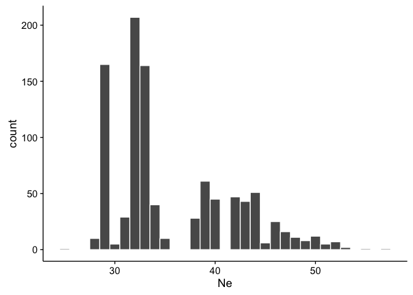
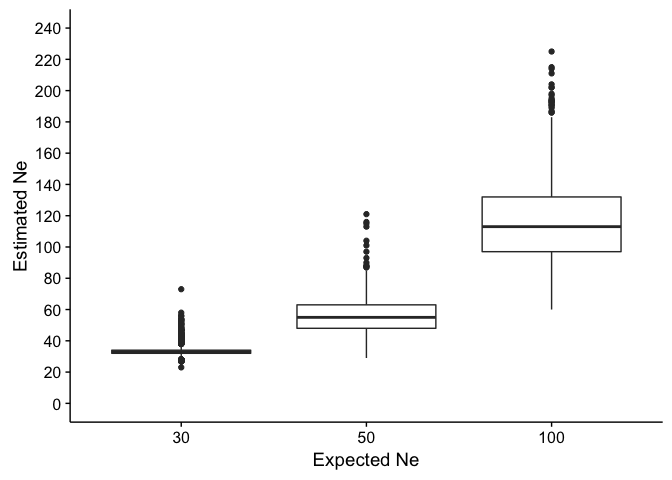
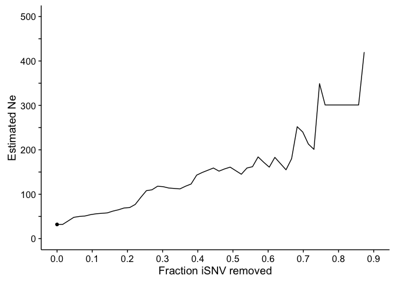

Intrahost model
================
JT McCrone
4/18/2017

    ## Loading required package: knitr

    ## Loading required package: ggplot2

    ## Loading required package: plyr

    ## Loading required package: reshape2

    ## Loading required package: extrafont

    ## Registering fonts with R

    ## Loading required package: wesanderson

    ## Loading required package: grid

    ## Loading required package: tidyverse

    ## Loading tidyverse: tibble
    ## Loading tidyverse: tidyr
    ## Loading tidyverse: readr
    ## Loading tidyverse: purrr
    ## Loading tidyverse: dplyr

    ## Conflicts with tidy packages ----------------------------------------------

    ## arrange():   dplyr, plyr
    ## compact():   purrr, plyr
    ## count():     dplyr, plyr
    ## failwith():  dplyr, plyr
    ## filter():    dplyr, stats
    ## id():        dplyr, plyr
    ## lag():       dplyr, stats
    ## mutate():    dplyr, plyr
    ## rename():    dplyr, plyr
    ## summarise(): dplyr, plyr
    ## summarize(): dplyr, plyr

    ## Loading required package: magrittr

    ## 
    ## Attaching package: 'magrittr'

    ## The following object is masked from 'package:purrr':
    ## 
    ##     set_names

    ## The following object is masked from 'package:tidyr':
    ## 
    ##     extract

    ## Loading required package: ggdendro

    ## Loading required package: doMC

    ## Loading required package: foreach

    ## 
    ## Attaching package: 'foreach'

    ## The following objects are masked from 'package:purrr':
    ## 
    ##     accumulate, when

    ## Loading required package: iterators

    ## Loading required package: parallel

    ## Loading required package: cowplot

    ## 
    ## Attaching package: 'cowplot'

    ## The following object is masked from 'package:ggplot2':
    ## 
    ##     ggsave

    ## 
    ## Call:
    ## lm(formula = freq2 ~ freq1, data = same_day)
    ## 
    ## Residuals:
    ##       Min        1Q    Median        3Q       Max 
    ## -0.033757 -0.008525 -0.000232  0.006217  0.037577 
    ## 
    ## Coefficients:
    ##               Estimate Std. Error t value Pr(>|t|)    
    ## (Intercept) -0.0001013  0.0070458  -0.014    0.989    
    ## freq1        1.0157604  0.0288881  35.162 1.79e-13 ***
    ## ---
    ## Signif. codes:  0 '***' 0.001 '**' 0.01 '*' 0.05 '.' 0.1 ' ' 1
    ## 
    ## Residual standard error: 0.01931 on 12 degrees of freedom
    ## Multiple R-squared:  0.9904, Adjusted R-squared:  0.9896 
    ## F-statistic:  1236 on 1 and 12 DF,  p-value: 1.787e-13

### Are the iSNV independent

    ## 
    ##  Wilcoxon rank sum test with continuity correction
    ## 
    ## data:  diffs by group
    ## W = 46318, p-value = 8.368e-06
    ## alternative hypothesis: true location shift is greater than 0

If we pick 1/ person

    ##        Ne          iteration     
    ##  Min.   :25.00   Min.   :   1.0  
    ##  1st Qu.:32.00   1st Qu.: 250.8  
    ##  Median :33.00   Median : 500.5  
    ##  Mean   :35.72   Mean   : 500.5  
    ##  3rd Qu.:40.00   3rd Qu.: 750.2  
    ##  Max.   :57.00   Max.   :1000.0

### Simulations

### Effect of removing data

 \# Gif example
