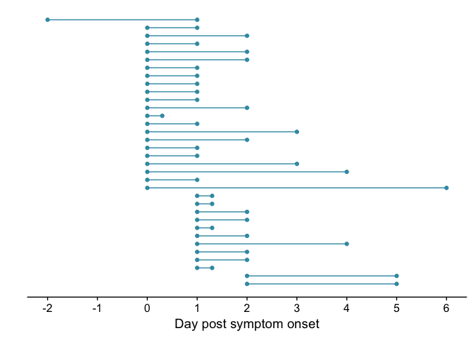
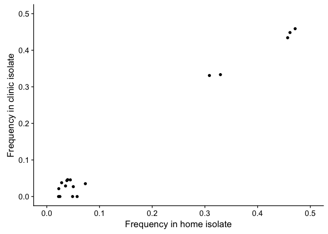
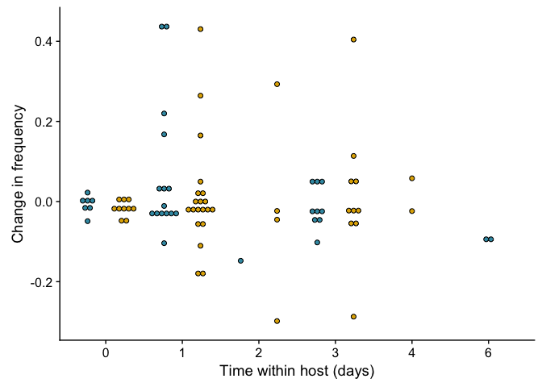
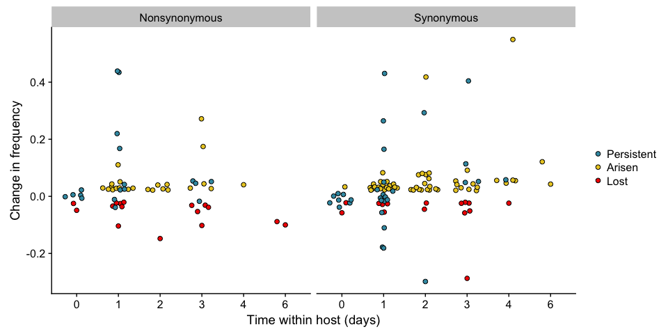
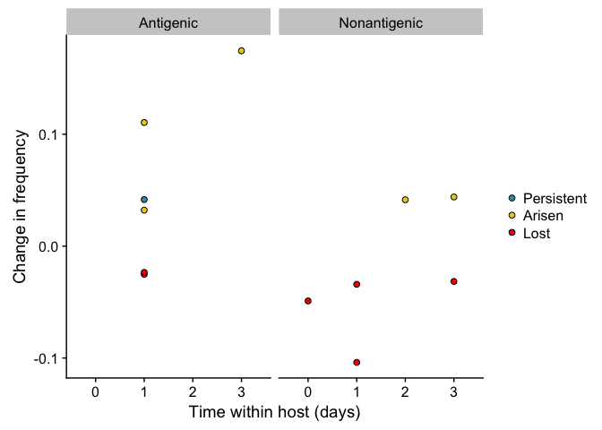

Intrahost model
================
JT McCrone
4/18/2017

    ## Loading required package: knitr

    ## Warning: package 'knitr' was built under R version 3.4.1

    ## Loading required package: ggplot2

    ## Loading required package: magrittr

    ## Loading required package: tidyverse

    ## Warning: package 'tidyverse' was built under R version 3.4.2

    ## ── Attaching packages ─────────────────────────────────────────────────────────────────────── tidyverse 1.2.0 ──

    ## ✔ tibble  1.3.4     ✔ purrr   0.2.4
    ## ✔ tidyr   0.7.2     ✔ dplyr   0.7.4
    ## ✔ readr   1.1.1     ✔ stringr 1.2.0
    ## ✔ tibble  1.3.4     ✔ forcats 0.2.0

    ## Warning: package 'tibble' was built under R version 3.4.1

    ## Warning: package 'purrr' was built under R version 3.4.2

    ## Warning: package 'dplyr' was built under R version 3.4.2

    ## ── Conflicts ────────────────────────────────────────────────────────────────────────── tidyverse_conflicts() ──
    ## ✖ tidyr::extract()   masks magrittr::extract()
    ## ✖ dplyr::filter()    masks stats::filter()
    ## ✖ dplyr::lag()       masks stats::lag()
    ## ✖ purrr::set_names() masks magrittr::set_names()

    ## Loading required package: HIVEr

    ## Loading required package: extrafont

    ## Registering fonts with R

    ## Loading required package: wesanderson

    ## Loading required package: grid

    ## Loading required package: ggbeeswarm

    ## Warning: package 'ggbeeswarm' was built under R version 3.4.1

    ## Loading required package: doMC

    ## Loading required package: foreach

    ## 
    ## Attaching package: 'foreach'

    ## The following objects are masked from 'package:purrr':
    ## 
    ##     accumulate, when

    ## Loading required package: iterators

    ## Loading required package: parallel

    ## Loading required package: cowplot

    ## Warning: package 'cowplot' was built under R version 3.4.1

    ## 
    ## Attaching package: 'cowplot'

    ## The following object is masked from 'package:ggplot2':
    ## 
    ##     ggsave

    ## Warning: Missing column names filled in: 'X1' [1]

    ## Warning: Duplicated column names deduplicated: 'X1' => 'X1_1' [2]

    ## Parsed with column specification:
    ## cols(
    ##   X1 = col_integer(),
    ##   X1_1 = col_integer(),
    ##   HOUSE_ID = col_integer(),
    ##   ENROLLID = col_character(),
    ##   SPECID = col_character(),
    ##   onset = col_date(format = ""),
    ##   collect = col_date(format = ""),
    ##   vaccination_status = col_integer(),
    ##   pcr_result = col_character(),
    ##   LAURING_ID = col_character(),
    ##   DPI = col_integer(),
    ##   season = col_character(),
    ##   log_copy_num = col_double(),
    ##   gc_ul = col_double(),
    ##   HIGHSD = col_character(),
    ##   sequenced = col_logical(),
    ##   home_collected = col_integer(),
    ##   snv_qualified = col_logical()
    ## )

    ## Warning: Missing column names filled in: 'X1' [1]

    ## Parsed with column specification:
    ## cols(
    ##   .default = col_character(),
    ##   X1 = col_integer(),
    ##   pos = col_integer(),
    ##   HOUSE_ID = col_integer(),
    ##   ENROLLID = col_integer(),
    ##   onset = col_date(format = ""),
    ##   collect1 = col_date(format = ""),
    ##   collect2 = col_date(format = ""),
    ##   gc_ul1 = col_double(),
    ##   gc_ul2 = col_double(),
    ##   home_collected1 = col_integer(),
    ##   home_collected2 = col_integer(),
    ##   freq1 = col_double(),
    ##   freq2 = col_double(),
    ##   within_host_time = col_integer()
    ## )

    ## See spec(...) for full column specifications.

    ## 
    ## Call:
    ## lm(formula = freq2 ~ freq1, data = same_day)
    ## 
    ## Residuals:
    ##       Min        1Q    Median        3Q       Max 
    ## -0.042966 -0.009711 -0.004810  0.015715  0.032738 
    ## 
    ## Coefficients:
    ##              Estimate Std. Error t value Pr(>|t|)    
    ## (Intercept) -0.015594   0.007089   -2.20   0.0439 *  
    ## freq1        1.017025   0.031336   32.46  2.6e-15 ***
    ## ---
    ## Signif. codes:  0 '***' 0.001 '**' 0.01 '*' 0.05 '.' 0.1 ' ' 1
    ## 
    ## Residual standard error: 0.02212 on 15 degrees of freedom
    ## Multiple R-squared:  0.986,  Adjusted R-squared:  0.985 
    ## F-statistic:  1053 on 1 and 15 DF,  p-value: 2.598e-15

Within host dynamics
--------------------

Within host classes
===================

    ## Warning: Missing column names filled in: 'X1' [1]

    ## quartz_off_screen 
    ##                 2

Antigenic
---------

    ## Warning: Missing column names filled in: 'X1' [1]

    ## Warning: Duplicated column names deduplicated: 'X1' => 'X1_1' [52]

    ## Joining, by = c("ENROLLID", "mutation")

