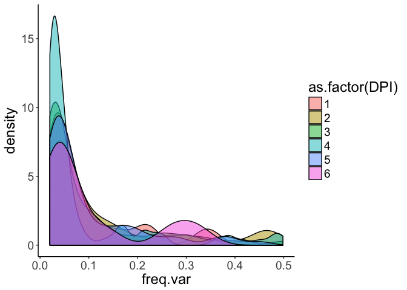
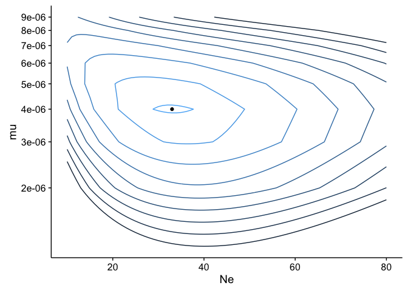
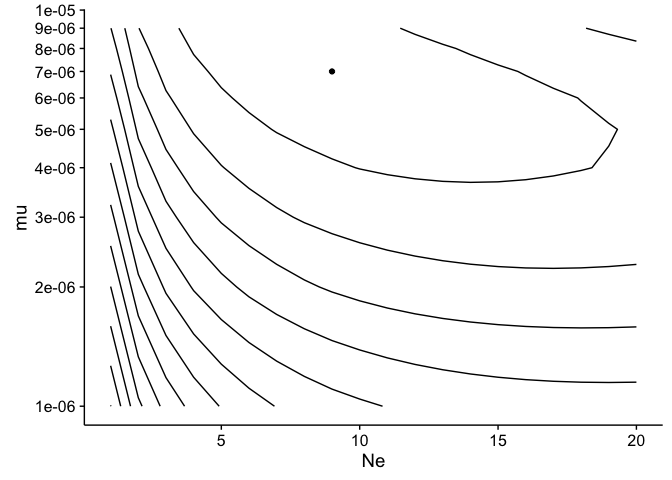
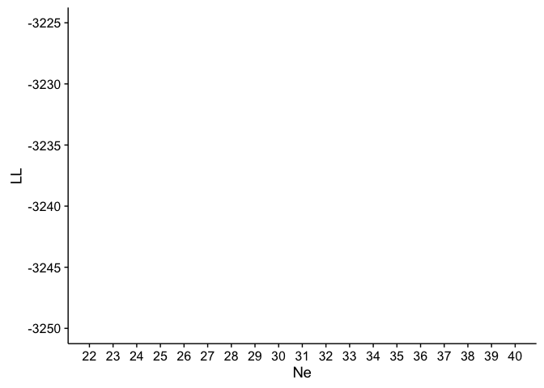
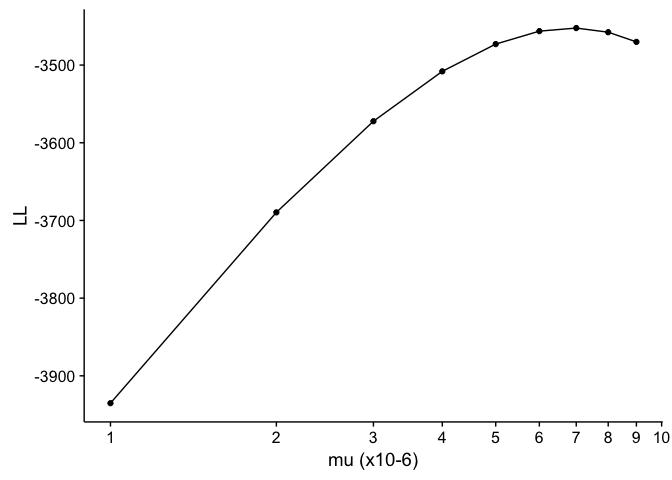

mutational model
================
JT McCrone
4/18/2017

    ## Loading required package: knitr

    ## Loading required package: ggplot2

    ## Loading required package: plyr

    ## Loading required package: reshape2

    ## Loading required package: extrafont

    ## Registering fonts with R

    ## Loading required package: wesanderson

    ## Loading required package: grid

    ## Loading required package: directlabels

    ## Loading required package: ggdendro

    ## Loading required package: doMC

    ## Loading required package: foreach

    ## Loading required package: iterators

    ## Loading required package: parallel

    ## Loading required package: magrittr

Frequency distribution
======================

 \# Estimating \(N_e\) and \(\mu_e\) The goal here is to allow for the mutations to enter the system at a given rate so that we can go backwards in time when we need to. Here we are relying on the assumption that no polymorphisms are present at the start of infection

Here the probability function for \(0<f<1\) is given by

\[
g(f,t) = \frac{2 \mu N_e}{f} e^{- \frac{2N_ef}{t}}
\] I am assumining anything present at less than 0.001 is present at 0.

Likelihood functions
--------------------

6 hours
=======

    ## 
    ## Attaching package: 'plotly'

    ## The following objects are masked from 'package:plyr':
    ## 
    ##     arrange, mutate, rename, summarise

    ## The following object is masked from 'package:ggplot2':
    ## 
    ##     last_plot

    ## The following object is masked from 'package:stats':
    ## 
    ##     filter

    ## The following object is masked from 'package:graphics':
    ## 
    ##     layout

    ## Loading required package: cowplot

    ## 
    ## Attaching package: 'cowplot'

    ## The following object is masked from 'package:ggplot2':
    ## 
    ##     ggsave

||mu|Ne|LL|
|---|--:|--:|--:|
|211|4e-06|33|-3271.048|

12 hours
========

||mu|Ne|LL|
|---|--:|--:|--:|
|79|7e-06|9|-3452.346|

