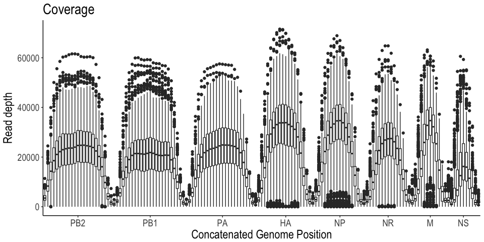
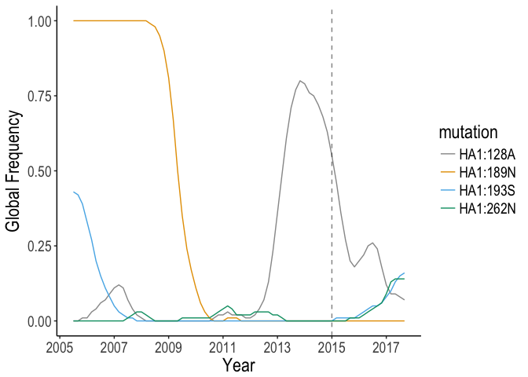
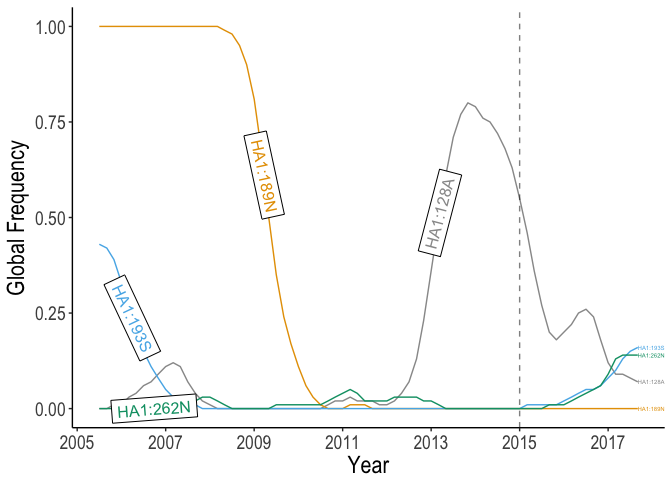
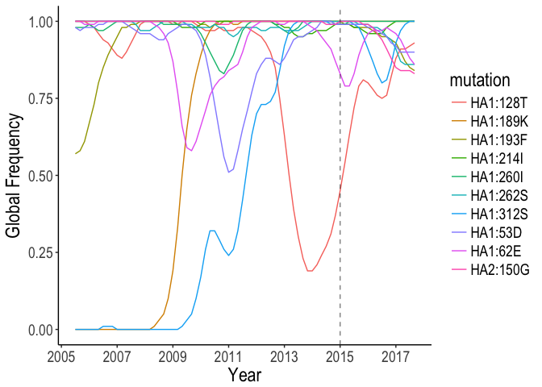
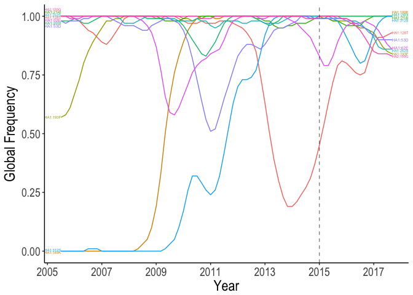

Supplemental
================

    ## Loading required package: knitr

    ## Loading required package: ggplot2

    ## Loading required package: plyr

    ## Loading required package: reshape2

    ## Loading required package: extrafont

    ## Registering fonts with R

    ## Loading required package: wesanderson

    ## Loading required package: cowplot

    ## 
    ## Attaching package: 'cowplot'

    ## The following object is masked from 'package:ggplot2':
    ## 
    ##     ggsave

    ## Loading required package: ggdendro

    ## Loading required package: grid

    ## Loading required package: doMC

    ## Loading required package: foreach

    ## Loading required package: iterators

    ## Loading required package: parallel

    ## Loading required package: magrittr

    ## Loading required package: tidyverse

    ## Loading tidyverse: tibble
    ## Loading tidyverse: tidyr
    ## Loading tidyverse: readr
    ## Loading tidyverse: purrr
    ## Loading tidyverse: dplyr

    ## Conflicts with tidy packages ----------------------------------------------

    ## accumulate(): purrr, foreach
    ## arrange():    dplyr, plyr
    ## compact():    purrr, plyr
    ## count():      dplyr, plyr
    ## failwith():   dplyr, plyr
    ## filter():     dplyr, stats
    ## ggsave():     ggplot2, cowplot
    ## id():         dplyr, plyr
    ## lag():        dplyr, stats
    ## mutate():     dplyr, plyr
    ## rename():     dplyr, plyr
    ## summarise():  dplyr, plyr
    ## summarize():  dplyr, plyr
    ## when():       purrr, foreach

    ## [1] "reading in ../data/processed/HK_1/all.coverage.csv"
    ## [1] "appending run column: HK_1"
    ## [1] "reading in ../data/processed/HK_2/all.coverage.csv"
    ## [1] "appending run column: HK_2"
    ## [1] "reading in ../data/processed/HK_6/all.coverage.csv"
    ## [1] "appending run column: HK_6"
    ## [1] "reading in ../data/processed/HK_7/all.coverage.csv"
    ## [1] "appending run column: HK_7"
    ## [1] "reading in ../data/processed/HK_8/all.coverage.csv"
    ## [1] "appending run column: HK_8"
    ## [1] "reading in ../data/processed/cali09/all.coverage.csv"
    ## [1] "appending run column: cali09"
    ## [1] "reading in ../data/processed/cali09_2/all.coverage.csv"
    ## [1] "appending run column: cali09_2"
    ## [1] "reading in ../data/processed/victoria/all.coverage.csv"
    ## [1] "appending run column: victoria"
    ## [1] "reading in ../data/processed/victoria_2/all.coverage.csv"
    ## [1] "appending run column: victoria_2"
    ## [1] "reading in ../data/processed/perth/all.coverage.csv"
    ## [1] "appending run column: perth"
    ## [1] "reading in ../data/processed/perth_2/all.coverage.csv"
    ## [1] "appending run column: perth_2"

Here are the minor nonsynounous mutations in H3N2 and H1N1 samples named as amino acid position and variant in the HA numbering skeme.

H3N2 : HA1:62G, HA1:297A, HA1:86I, -, HA1:214T, -, HA2:154K, HA1:193S, HA1:128A, HA1:260V, HA1:262N, HA1:114L, -, HA1:202V, HA1:208R, HA1:163T, HA2:150R, HA1:307R, HA2:133I, HA2:106H, HA1:189N, HA2:3L, HA1:268L, HA1:53E, HA1:312G, HA2:141F, HA1:242T, HA1:106T, HA1:242L, HA1:291N, HA1:272S, HA1:307R H1N1 : HA2:107N, HA2:145N, HA1:251T, HA1:211K, HA1:188Q

These were pasted into nextflu and their frequencies downloaded. None of the H1N1 minor positions were found in next flu.

All the samples here we taken in december 2015.

    ## Loading required package: lubridate

    ## Loading required package: methods

    ## 
    ## Attaching package: 'lubridate'

    ## The following object is masked from 'package:plyr':
    ## 
    ##     here

    ## The following object is masked from 'package:base':
    ## 
    ##     date

    ## Loading required package: directlabels

||collect|SPECID|H3\_name|freq.var|
|---|:------|:-----|:-------|-------:|
|8|2014-12-08|MH7851|HA1:193S|0.1745625|
|9|2014-12-09|MH7860|HA1:128A|0.1105225|
|11|2014-12-13|MH8052|HA1:262N|0.0301232|
|21|2014-12-12|HS1450|HA1:189N|0.0378271|

