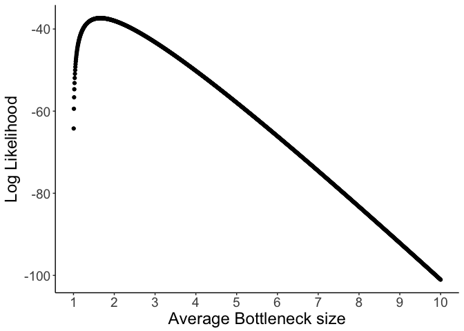
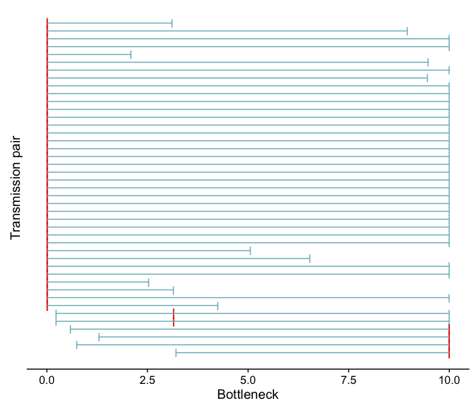
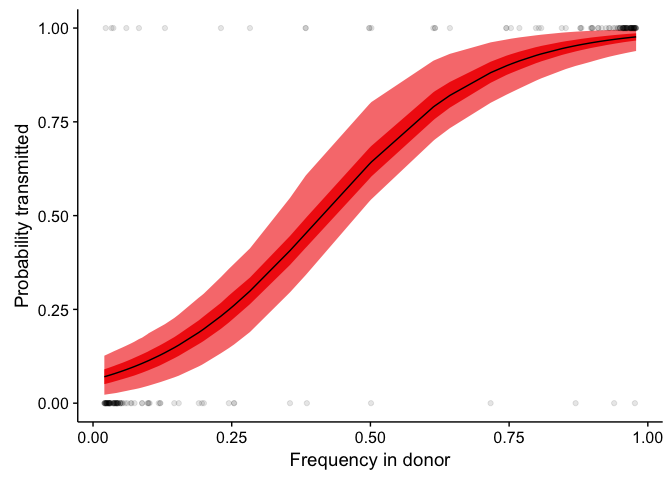
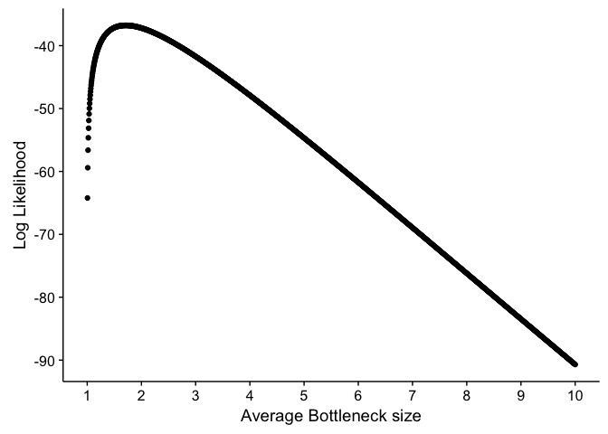
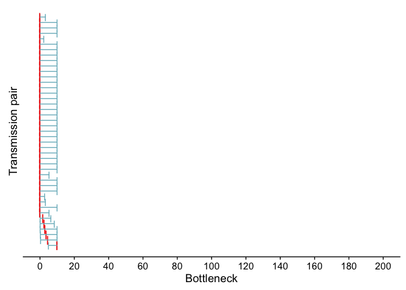
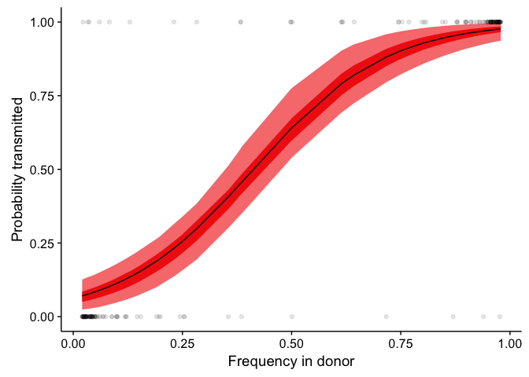
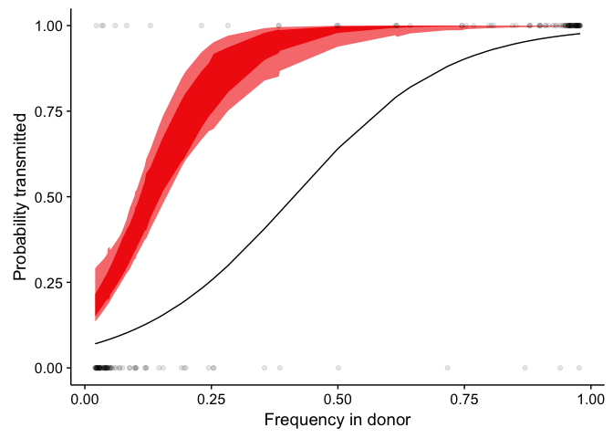
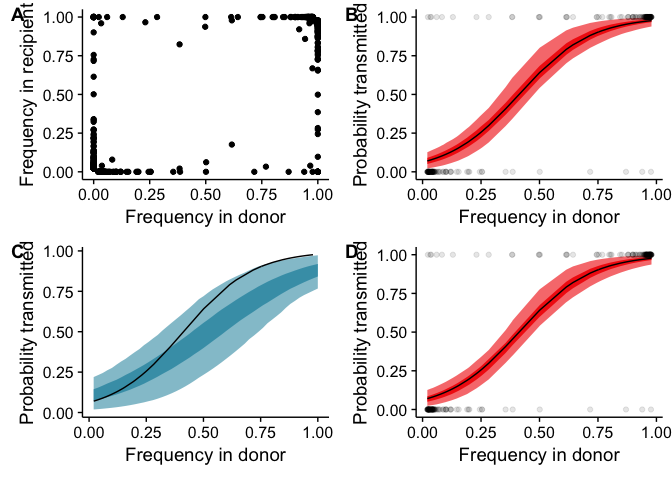

Transmission models
================
JT McCrone
4/7/2017

    ## Loading required package: knitr

    ## Loading required package: ggplot2

    ## Loading required package: plyr

    ## Loading required package: reshape2

    ## Loading required package: extrafont

    ## Registering fonts with R

    ## Loading required package: wesanderson

    ## Loading required package: ggdendro

    ## Loading required package: grid

    ## Loading required package: doMC

    ## Loading required package: foreach

    ## Loading required package: iterators

    ## Loading required package: parallel

    ## Loading required package: magrittr

Presence/Absence model
======================

Let \(A_1\) and \(A_2\) be a alleles in the donor. Then there are three possible outcomes of transmission. Either \(A_1\) is transmitted, \(A_2\) is transmitted, or both \(A_1\) and \(A_2\) are transmitted. The probability of only one allele being transmitted (let's call it \(A_i\)) given a bottleneck size of \(N_b\) is \[
P(A_i) = f_i^{N_b}
\]

Where \(p_i\) is the frequency of the allele in the donor. In otherwords this is simply the probability of only drawing \(A_i\) in \(N_b\) draws.

The probability of both alleles being transmitted is given by

\[
P(A_1,A_2) = 1- \big(f_1^{N_b}+f_2^{N_b}\big)
\]

where \(f_1\) and \(f_2\) are the frequencies of the alleles respectively. This is simply the probability of not picking only \(A_1\) or only \(A_2\) in \(N_b\) draws.

We can then define the probability of observing the data at each polymorphic site \(j\) as \(P_j\) where \(P_j=P(A_i)\) if only one allele is transmitted and \(P_j=P(A_1,A_2)\) if two alleles are transmitted.

The likelihood of a bottleneck size \(N_b\) is then given by

\[
L(N_b) = \prod^j P_j
\]

or the probability of observing the data at each polymorphic site. Thus the log likelihood is given by

\[
\text{log}(L(N_b)) = \sum^j\text{log}(P_j)
\]

### Fitting the Presence/Absence model

In this fit we take the minority frequency to the correct and set the major frequency to 1-minority

    ##     Nb lower_95 upper_95     mean
    ## 1 1.12     0.51     1.99 1.662411

### Log likelihood plot

    ## Loading required package: cowplot

    ## 
    ## Attaching package: 'cowplot'

    ## The following object is masked from 'package:ggplot2':
    ## 
    ##     ggsave

### Fits by pair

For fun 

### Simulation

Beta binomial model
===================

The Beta binomial model is explained in detail in Leonard . It is similar to the presence/absence model in that transmission is modeled as a simple sampling process; however, it loosens the assumption that the frequencies in the recipient are constant overtime. Instead frequencies of transmitted variants are allowed to change between transmission and sampling according the a beta distribution. The distribution is not dependent on the amount of time that passes between transmission and sampling, and the frequency in the donor is assumed to be the same between sampling and transmission.

The equations below are very similar to those present by Leonard with two exceptions. (1) We fit a distribution to the bottleneck sizes in our cohort, and (2) because we know our sensitivity to detect rare variants based on the expected frequency of the iSNV and the titer of the sample we can include the possiblity that iSNV are transmitted but are missed due to less than perfect sensitivity.

\[
L(N_b)_i=\sum_{k=0}^{N_b}\text{p_beta}\Big( _{R,i}|k,N_b-k\Big)\text{p_bin}\Big(k|N_b,v_{D,i}\Big)
\]

and

I will start with the most conservative assumption. We will always round the titer and frequency down to the nearest standard and apply that accuracy. Also I'm assuming the accuracy is perfect in the donor.

So now the likelihood function of lost variants is given by

\[
L(N_b)_i=\sum_{k=0}^{N_b}\Big[\text{p_beta_cdf}\Big( v_{R,i}<T|k,N_b-k\Big)\text{p_bin}\Big(k|N_b,v_{D,i}\Big)+\sum_{f_i}^{[0.02,0.05,0.1)}\text{p_beta}\big(f_i<v_{R,i}<f_{i+1}\big|k,N_b-k\big)\text{p_bin}\Big(k|N_b,v_{D,i}\Big)\big(1-\text{sensitivity}|\text{titer}_R,f_i)\Big]
\] In other words what is the probability the (variant was not transmitted or transmitted but remains \<2%) or ( the variant was transmitted and is present within a given frequency range and we don't find it given the lower end of that frequency range and the titer of the sample.)

Fitting
-------

    ##     Nb lower_95 upper_95     mean
    ## 1 1.19     0.55     2.12 1.710314

### Loglikelihodd plot

### Fitting by person

Simulations
-----------

 \#\# lambda = 10

|Model|AIC|
|:----|--:|
|Presence/Absence|76.69269|
|BetaBinomial|75.54817|

|Model|Nb|lower\_95|upper\_95|mean|
|:----|--:|--------:|--------:|---:|
|Presence Absence|1.12|0.51|1.99|1.662411|
|BetaBinomial|1.19|0.55|2.12|1.710314|

Figure 4
========

