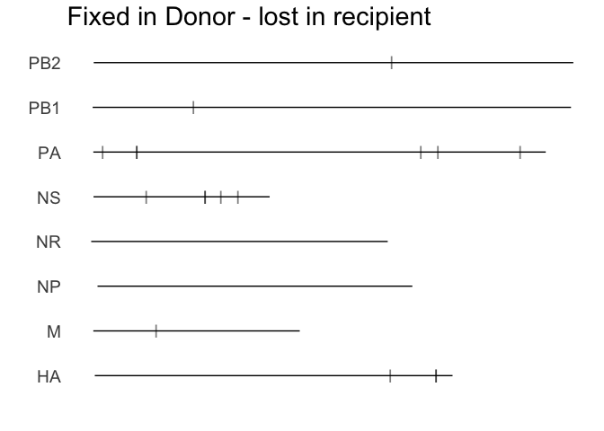
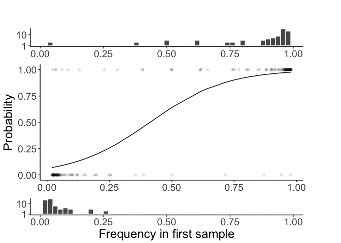
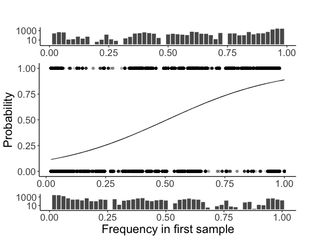
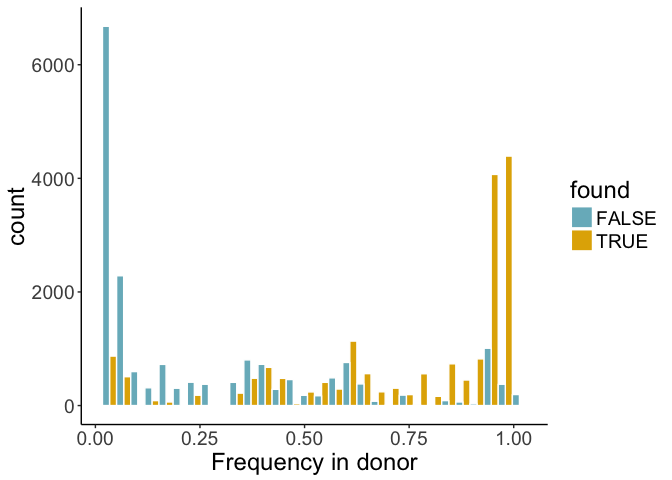
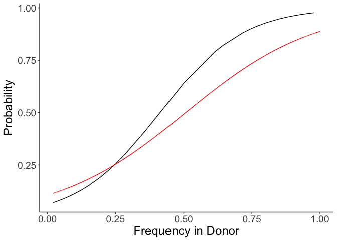
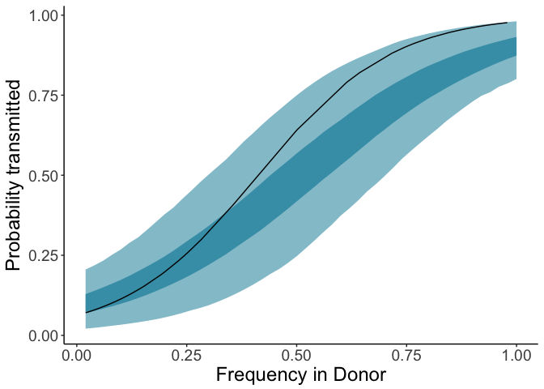

Transmission set up
================
JT McCrone
4/4/2017

    ## Loading required package: knitr

    ## Loading required package: ggplot2

    ## Loading required package: plyr

    ## Loading required package: extrafont

    ## Registering fonts with R

    ## Loading required package: wesanderson

    ## Loading required package: grid

    ## Loading required package: reshape2

    ## Loading required package: ggdendro

    ## Loading required package: doMC

    ## Loading required package: foreach

    ## Loading required package: iterators

    ## Loading required package: parallel

    ## Loading required package: magrittr

Set up
======

Reading in the transmission pairs and the quality snv

Getting the SPECID for each pair.

Here we use the following criteria - note this may result in different SPECID than used in the L1-norm measurements.

1.  Sample closest to transmission that are on the "right side" of tranmission (before transmission for donor if possible)

2.  Titer is the tie breaker when applicable.

Here we are going to count the minority iSNV in each sample.

    ## Joining by: SPECID

    ## [1] "SPECID HS1416  being used for ENROLLID 50305 based on the time to the transmission date even though this sample has a lower titer thanMH7890"
    ## [1] "SPECID HS1335  being used for ENROLLID 50319 based on the time to the transmission date even though this sample has a lower titer thanMH7612"
    ## [1] "SPECID HS1417  being used for ENROLLID 50331 based on the time to the transmission date even though this sample has a lower titer thanMH7891"
    ## [1] "SPECID HS1516  being used for ENROLLID 50468 based on the time to the transmission date even though this sample has a lower titer thanMH8439"
    ## [1] "SPECID HS1516  being used for ENROLLID 50468 based on the time to the transmission date even though this sample has a lower titer thanMH8439"
    ## [1] "SPECID MH7385  being used for ENROLLID 50632 based on the time to the transmission date even though this sample has a lower titer thanHS1253"
    ## [1] "SPECID MH7953  being used for ENROLLID 50812 based on the time to the transmission date even though this sample has a lower titer thanHS1427"
    ## [1] "SPECID MH8390  being used for ENROLLID 50851 based on the time to the transmission date even though this sample has a lower titer thanHS1509"
    ## [1] "SPECID MH7687  being used for ENROLLID 50969 based on the time to the transmission date even though this sample has a lower titer thanHS1351"

Now will compare the frequencies of mutations found in both samples.

 It is pecular that there are fixed differences between the donor and recipient. My hunch is that they are near the ends of the segment.

    ## [1] 17

Do these check out or do we think they are bugs.

Here I read in the raw variant calls.There are a lot so it takes some time.

What would we expect? Well here is our accuracy and the number of iSNV in each bin. A little back of the envelope calculation where we assume all variants between 2-5% have sensivity of 2% and all between 5-10% have sensitivity of 5%.

    ## Joining by: freq, gc_ul

    ## [1] 9.34

We would expect 11. We find 17, but clearly NS is an outlier.

Now we will restrick our analysis only to sites that are polymporphic in the donor.

### Probability of transmission as a function of donor frequency

### Community pairs

The community plot is flatter than the household one but - the log scale makes the histograms a bit miss leading.

    ## `stat_bin()` using `bins = 30`. Pick better value with `binwidth`.

Looking at just the variants in the transmission pair donors.
-------------------------------------------------------------

For a better comparision we will sample the community pairs that have the same donors as our transmission pairs. In essence we are asking what is the probability this variant would have been seen again if the pairs were random.

There is 1 transmission pair of 2010-2011 that is H1N1. We don't have the donor in these pairs becasue no one in the cohort gave us a useable sequence from after this onset date of that strain that season.

Checking
--------

What if we don't require the community pairs to have a time dependency. The recipient could be sick first.

