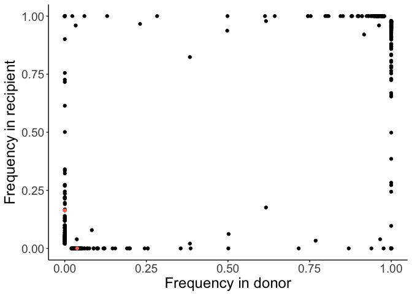

Transmission set up
================
JT McCrone
4/4/2017

    ## Loading required package: knitr

    ## Loading required package: ggplot2

    ## Loading required package: magrittr

    ## Loading required package: tidyverse

    ## ── Attaching packages ────────────────────────────────── tidyverse 1.2.1 ──

    ## ✔ tibble  1.3.4     ✔ purrr   0.2.4
    ## ✔ tidyr   0.7.2     ✔ dplyr   0.7.4
    ## ✔ readr   1.1.1     ✔ stringr 1.2.0
    ## ✔ tibble  1.3.4     ✔ forcats 0.2.0

    ## ── Conflicts ───────────────────────────────────── tidyverse_conflicts() ──
    ## ✖ tidyr::extract()   masks magrittr::extract()
    ## ✖ dplyr::filter()    masks stats::filter()
    ## ✖ dplyr::lag()       masks stats::lag()
    ## ✖ purrr::set_names() masks magrittr::set_names()

    ## Loading required package: HIVEr

    ## Loading required package: extrafont

    ## Registering fonts with R

    ## Loading required package: wesanderson

    ## Loading required package: grid

    ## Loading required package: doMC

    ## Loading required package: foreach

    ## 
    ## Attaching package: 'foreach'

    ## The following objects are masked from 'package:purrr':
    ## 
    ##     accumulate, when

    ## Loading required package: iterators

    ## Loading required package: parallel

Set up
======

Reading in the transmission pairs and the quality snv

    ## Warning: Missing column names filled in: 'X1' [1]

    ## Warning: Duplicated column names deduplicated: 'X1' => 'X1_1' [2]

    ## Parsed with column specification:
    ## cols(
    ##   X1 = col_integer(),
    ##   X1_1 = col_integer(),
    ##   HOUSE_ID = col_integer(),
    ##   ENROLLID = col_character(),
    ##   SPECID = col_character(),
    ##   onset = col_date(format = ""),
    ##   collect = col_date(format = ""),
    ##   vaccination_status = col_integer(),
    ##   pcr_result = col_character(),
    ##   LAURING_ID = col_character(),
    ##   DPI = col_integer(),
    ##   season = col_character(),
    ##   log_copy_num = col_double(),
    ##   gc_ul = col_double(),
    ##   HIGHSD = col_character(),
    ##   sequenced = col_logical(),
    ##   home_collected = col_integer(),
    ##   snv_qualified = col_logical()
    ## )

    ## Warning: Missing column names filled in: 'X1' [1]

    ## Warning: Duplicated column names deduplicated: 'X1' => 'X1_1' [51]

    ## Warning: Missing column names filled in: 'X1' [1]

    ## Parsed with column specification:
    ## cols(
    ##   .default = col_logical(),
    ##   X1 = col_integer(),
    ##   HOUSE_ID = col_integer(),
    ##   pcr_result = col_character(),
    ##   season = col_character(),
    ##   ENROLLID1 = col_character(),
    ##   ENROLLID2 = col_character(),
    ##   onset1 = col_date(format = ""),
    ##   onset2 = col_date(format = ""),
    ##   transmission = col_date(format = ""),
    ##   gc_ul1 = col_double(),
    ##   gc_ul2 = col_double(),
    ##   pair_id = col_integer()
    ## )

    ## See spec(...) for full column specifications.

    ## Warning: Missing column names filled in: 'X1' [1]

    ## Warning: Duplicated column names deduplicated: 'X1' => 'X1_1' [2]

    ## Parsed with column specification:
    ## cols(
    ##   .default = col_logical(),
    ##   X1 = col_integer(),
    ##   X1_1 = col_integer(),
    ##   HOUSE_ID = col_integer(),
    ##   ENROLLID1 = col_character(),
    ##   ENROLLID2 = col_character(),
    ##   onset1 = col_date(format = ""),
    ##   onset2 = col_date(format = ""),
    ##   transmission = col_date(format = ""),
    ##   pair_id = col_double(),
    ##   collect1 = col_date(format = ""),
    ##   collect2 = col_date(format = ""),
    ##   mutation = col_character(),
    ##   chr = col_character(),
    ##   pos = col_integer(),
    ##   ref = col_character(),
    ##   var = col_character(),
    ##   season = col_character(),
    ##   pcr_result = col_character(),
    ##   freq1 = col_double(),
    ##   freq2 = col_double()
    ##   # ... with 2 more columns
    ## )
    ## See spec(...) for full column specifications.

 It is pecular that there are fixed differences between the donor and recipient. My hunch is that they are near the ends of the segment.

    ## [1] 17

Do these check out or do we think they are bugs.

Here I read in the raw variant calls.There are a lot so it takes some time.

What would we expect? Well here is our accuracy and the number of iSNV in each bin. A little back of the envelope calculation where we assume all variants between 2-5% have sensivity of 2% and all between 5-10% have sensitivity of 5%.

We would expect 9. We find 17, but clearly NS is an outlier.

Now we will restrick our analysis only to sites that are polymporphic in the donor.

    ## Warning: Missing column names filled in: 'X1' [1]

    ## Warning: Duplicated column names deduplicated: 'X1' => 'X1_1' [6]

    ## Parsed with column specification:
    ## cols(
    ##   .default = col_logical(),
    ##   X1 = col_integer(),
    ##   chr = col_character(),
    ##   pos = col_integer(),
    ##   SPECID1 = col_character(),
    ##   SPECID2 = col_character(),
    ##   X1_1 = col_integer(),
    ##   HOUSE_ID = col_integer(),
    ##   ENROLLID1 = col_character(),
    ##   ENROLLID2 = col_character(),
    ##   onset1 = col_date(format = ""),
    ##   onset2 = col_date(format = ""),
    ##   transmission = col_date(format = ""),
    ##   pair_id = col_double(),
    ##   collect1 = col_date(format = ""),
    ##   collect2 = col_date(format = ""),
    ##   mutation = col_character(),
    ##   ref = col_character(),
    ##   var = col_character(),
    ##   season = col_character(),
    ##   pcr_result = col_character()
    ##   # ... with 2 more columns
    ## )

    ## See spec(...) for full column specifications.

### Probability of transmission as a function of donor frequency

    ## Warning: Transformation introduced infinite values in continuous y-axis

    ## Warning: Transformation introduced infinite values in continuous y-axis

 \#\#\# No frequency cut off

    ## Warning: Missing column names filled in: 'X1' [1]

    ## Warning: Duplicated column names deduplicated: 'X1' => 'X1_1' [2]

    ## Warning: Transformation introduced infinite values in continuous y-axis

    ## Warning: Transformation introduced infinite values in continuous x-axis

    ## Warning: Transformation introduced infinite values in continuous y-axis

    ## Warning: Transformation introduced infinite values in continuous x-axis

    ## Warning: Missing column names filled in: 'X1' [1]

    ## Warning: Duplicated column names deduplicated: 'X1' => 'X1_1' [6]

    ## Warning: Transformation introduced infinite values in continuous y-axis

    ## Warning: Transformation introduced infinite values in continuous y-axis

 

### Community pairs

    ## Warning: Missing column names filled in: 'X1' [1]

    ## Warning: Duplicated column names deduplicated: 'X1' => 'X1_1' [2]

    ## Warning: Missing column names filled in: 'X1' [1]

    ## Warning: Duplicated column names deduplicated: 'X1' => 'X1_1' [6]

The community plot is flatter than the household one but - the log scale makes the histograms a bit miss leading.

    ## Warning: Transformation introduced infinite values in continuous y-axis

    ## Warning: Transformation introduced infinite values in continuous y-axis

    ## `stat_bin()` using `bins = 30`. Pick better value with `binwidth`.

To get an idea of the spread around this line will sample the community pairs 1000 times each time grabbing the same number of transmission pairs as in the household data.

Appendex
========

What if we don't require the community pairs to have a time dependency. The recipient could be sick first.
